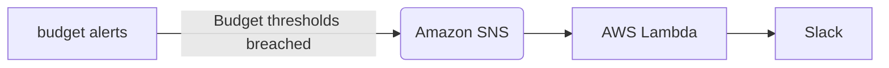

# AWS Budget Alerts to Slack

**This is an `experimental` repository to familiarize myself with Serverless Framework and Node.js**.



[](https://gyazo.com/4c464af43475252ba2ad6f214c43128e)

## TL;DR

```
$ cp .env.tmpl .env
$ sls deploy
```


## Technology used

```
$ sls --version
Framework Core: 3.2.0
Plugin: 6.0.0
SDK: 4.3.1
```

## References

- [[budget alerts]Serverless FrameworkとAWS Budgetsで日次の利用料金が想定より高かったらSlackへ通知する(Cost Anomaly Detectionは採用見送り) | gkzz.dev](https://gkzz.dev/posts/receive-aws-budget-alerts-in-serverless-framework-slack/)

## License
Copyright (c) 2022 [gkz](https://gkz.mit-license.org/2022)

Licensed under the [MIT license](LICENSE).

Unless attributed otherwise, everything is under the MIT licence. Some stuff is not from me, and without attribution, and I no longer remember where I got it from. I apologize for that.
